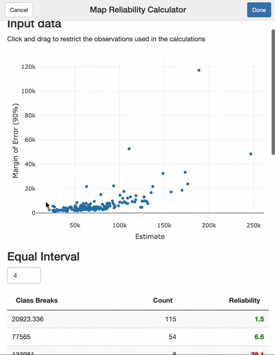

<!-- README.md is generated from README.Rmd. Please edit that file -->

```{r, include = FALSE}
knitr::opts_chunk$set(
  collapse = TRUE,
  comment = "#>",
  fig.path = "man/figures/README-",
  out.width = "100%"
)
```

# mapreliability

<!-- badges: start -->
<!-- badges: end -->

This package is a port of the [Map Reliabilty Calculator](https://www1.nyc.gov/site/planning/data-maps/nyc-population/geographic-reference.page) Excel-based tool produced by New York City Department of City Planning's Population Division.

When classifying survey estimate data for creating choropleth maps it is important to take the reliability of these estimates into account when creating the classification to ensure that there is an acceptable level of potential missclassification as a result of sampling error. 

The main feature of this package is an RStudio addin that allows you to interactively examine the reliability of various classifications to help determine a reliable set of classes for your map. 

## Installation

This package is not yet available on CRAN, so you can install the most recent version with:

``` r
install.packages("remotes")
remotes::install_github("austensen/mapreliability")
```

## Example data

For the examples will use estimates of median household income for Zip Code tabulation areas (ZCTAs) in New York City, which we can get from the American Community Survey using the wonderful [`tidycensus`](https://github.com/walkerke/tidycensus) package. 

```{r include=FALSE}
options(tigris_use_cache = TRUE)
```

```{r example-data, message=FALSE}
library(mapreliability)
library(tidycensus)
library(tidyverse)

nyc_zctas <- c(
  10001:10282, 10301:10314, 10451:10475, 11004:11005, 11101:11109, 
  11201:11239, 11351:11451, 11691:11697
)

nyc_hh_income <- get_acs(
  geography = "zcta",
  year = 2018,
  survey = "acs5",
  variables = "B19013_001",
  geometry = TRUE,
  key = Sys.getenv("CENSUS_API_KEY")
) %>% 
  filter(as.numeric(GEOID) %in% nyc_zctas)

nyc_hh_income
```

## Reliability tables

There are there basic functions that calculate the reliability of a classification and return a basic dataframe. For equal interval classification use `reliability_table_equal`, for quantiles use `reliability_table_quant`, and to test your own custom classification use `reliability_table_custom`.

```{r reliability-tables}
reliability_table_equal(nyc_hh_income, estimate, moe, 4)

reliability_table_quant(nyc_hh_income, estimate, moe, 4)

reliability_table_custom(nyc_hh_income, estimate, moe, c(10000, 50000, 75000, 100000))
```

The table that is returns shows, lower breakpoint for each class (`class_breaks`), the number of observations in each class (`count`), and the reliability for each class (`reliability`), which is defined as the likelihood, on average, that any given geography is erroneously classed. Then there are two total columns that show the total number of observations across all classes (`tot_count`), and the overall reliability of the classification (`tot_reliability`).

Be default, all these functions will raise a warnings notifying you about observations that are dropped because of missing values in the estimate or MOE. This can be turned off by using `quiet = TRUE`.

## Reliability calculator

To get a reliable classification it often takes a lot of fiddling with the number of classes or breakpoints, and it can be helpful to visualize the data you're working with while doing so. To make all this easier this package also includes an RStudio addin function that launches an interactive tool to help you find a reliable classification. 

In the plot of the estimates and MOEs, you can use the selection tools to select a subset of the data to test how the reliability results are affected by excluding some of observations with the largest margins of error. 

```{r reliablity-addin, eval=FALSE}
reliability_calculator(nyc_hh_income, estimate, moe)
```



## Example map

Based on the results from the tool, you might decide to exclude the three observations with incredibly large margins of error (> 40k), and then use the following custom classification, which passes the reliability test.

```{r map-code, fig.show="hide"}
inc_group_levels <- c(
  "Less than $40k",
  "$40k - $60k",
  "$60k - $80k",
  "$80k - $100k",
  "$100k or greater",
  "No data",
  "Insufficient data"
)

nyc_hh_income %>% 
  mutate(
    inc_group = case_when(
      is.na(estimate)   ~ "No data",
      moe >= 40000      ~ "Insufficient data",
      estimate < 40e3   ~ "Less than $40k",
      estimate < 60e3   ~ "$40k - $60k",
      estimate < 80e3   ~ "$60k - $80k",
      estimate < 100e3  ~ "$80k - $100k",
      estimate >= 100e3 ~ "$100k or greater"
    ),
    inc_group = ordered(inc_group, levels = inc_group_levels)
  ) %>% 
  ggplot() +
  geom_sf(aes(fill = inc_group), color = "white", size = 0.1) +
  scale_fill_manual(values = c(viridisLite::viridis(5), "grey40", "grey60")) +
  theme_void() +
  theme(
    plot.title.position = "plot",
    plot.caption.position = "plot",
    plot.caption = ggplot2::element_text(
      face = "italic",
      color = "grey40",
      hjust = 0,
      margin = ggplot2::margin(10, 0, 10, 0)
    ),
    legend.position = c(0.2, 0.75)
  ) +
  labs(
    title = "Median Household Income (2018$), 2014-2018",
    subtitle = "New York City, Zip Code Tabulation Areas",
    fill = NULL,
    caption = str_glue(
      "Source: American Community Survey (2014-2018)
      
      Notes: There is less than a 10% that chance any given geography in this map is
      misclassified due to sampling error. For each individual category, there is less than
      a 20% chance that any given geography is misclassified due to sampling error.
      Geographies with a margin of error (90%) greater than $40k are suppressed 
      because of insufficient data."
    )
  )
```

```{r map-image, echo=FALSE}
f <- tempfile(fileext = ".png")
ggsave(f, height = 6, width = 6)
knitr::include_graphics(f)
```
